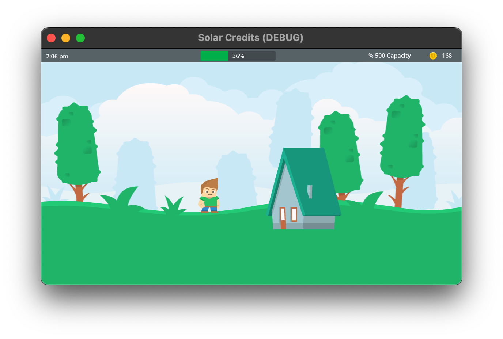

# Solar Credits

Made in Godot 4.x and inspired by Stellaris, Solar Credits explores the concept of earning money using renewable energy to earn Credits (**Ȼ**). This prototype is fairly simple in design. You own a simple household that has solar panels. When your battery reaches 100%, energy production temporarily halts, and you earn the sum of the total energy stored. Then it begins depleting until a certain minimum threshold is reached, and the cycle repeats.

## To-do

- [ ] Day-night cycle
- [ ] Marketplace

## Surplus of Potential

While much of this premise is fictional, don't get me wrong, this is technically already a feasible today. You can sell surplus for money in real life. Actually, it is a good motivation to get solar panels in the first place. So it isn't that far-fetched. This game just expands upon that concept by making the very act of generating energy your universal basic income instead. Selling the surplus shouldn't be an option, but a guarantee.

## License

I license this project under the GPL-3.0 license - see [LICENSE](LICENSE) for details.
